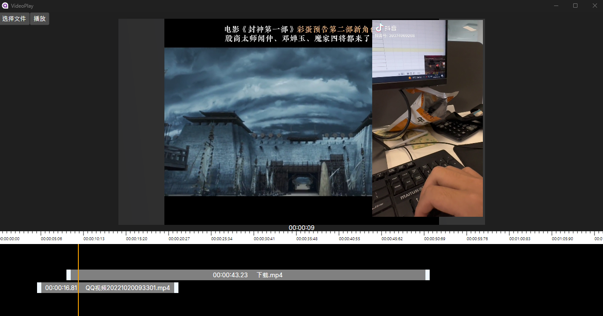

# VideoPlay
A video player created using Avalonia and ffmpeg

Need to download the ffmpeg library into the project

https://www.gyan.dev/ffmpeg/builds/

Put it in the Libx64 directory or use  ffmpeg.RootPath ="you floder";

In theory, across desktop platforms, I only tried Windows

https://mp.weixin.qq.com/s?__biz=MzU1MDI5MDIzMw==&mid=2247483676&idx=1&sn=f7b3e56dd280165c22d943035353cece&chksm=fba3974accd41e5c8e4fd713239f54b485415461d6bb5867cf8fe456c14e64c64d9608e04d10#rd

